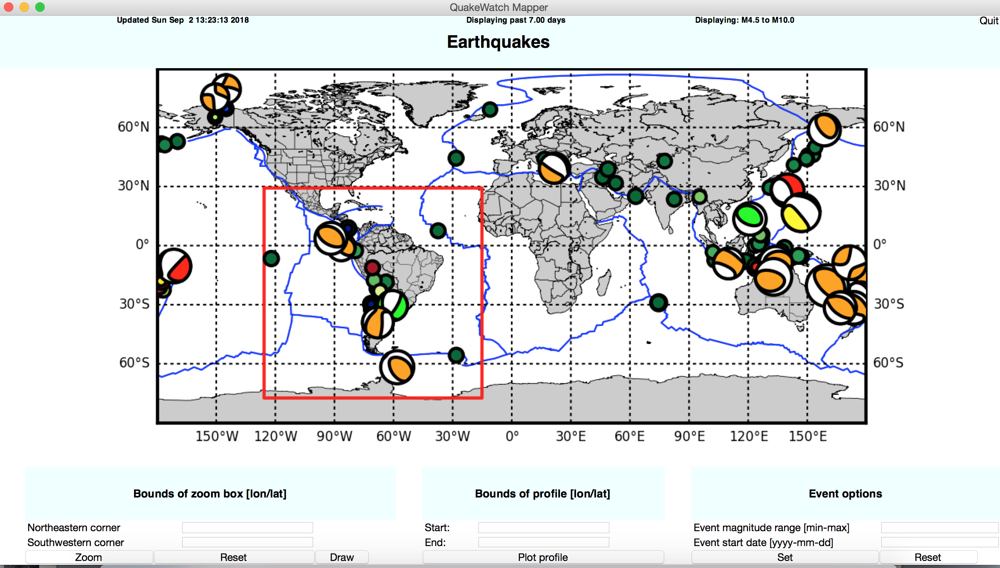
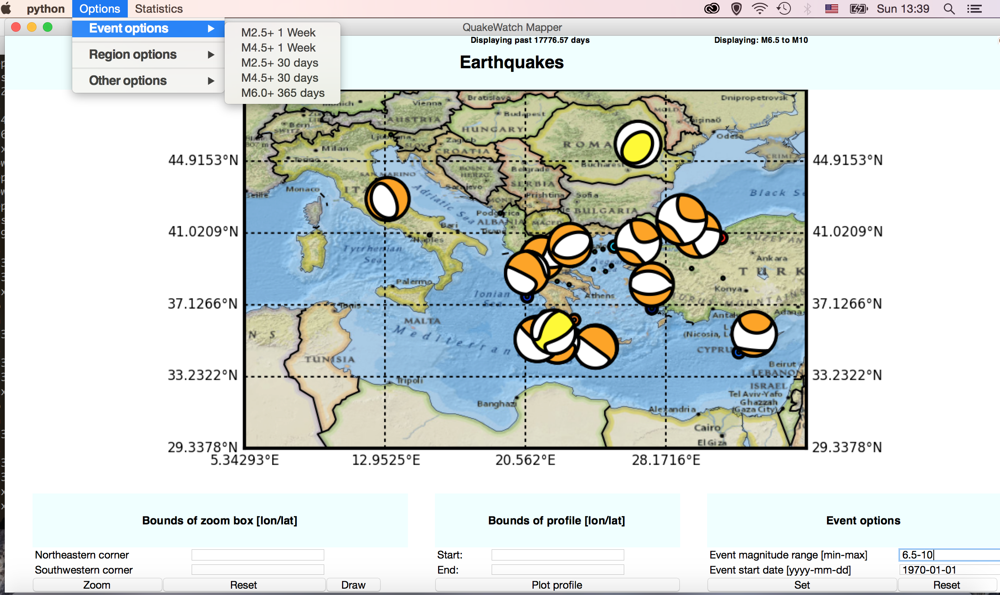

#### Earthquake display GUI    

Written for presentations in "Earthquake of the Week" seminar. It diplays global earthquake information, including focal mechanisms where available (from the USGS) and offers zoom tools to select different regions.   

Also offers the ability to update event magnitudes and time, allowing a user to investigate the seismic history of a region of interest. 

Clicking on the earthquake focal mechanisms takes the user to the USGS website for that earthquake, where more information can be obtained. 

#### Useage     

Download the repo and run ./QuakeWatch_GUI.py. There will likely be many warnings. Only works with Python 2.7, unfortunately. 

#### Screenshots  

##### Screenshot of the main display window, showing (by default) all earthquakes M4.5+ in the last week. The user can select a red box on the map by clicking and then press 'zoom' to get a zoomed in view of that area.

##### Screenshot of all events M6.5+ that have occured in the Mediterranean region since 1970-01-01.

